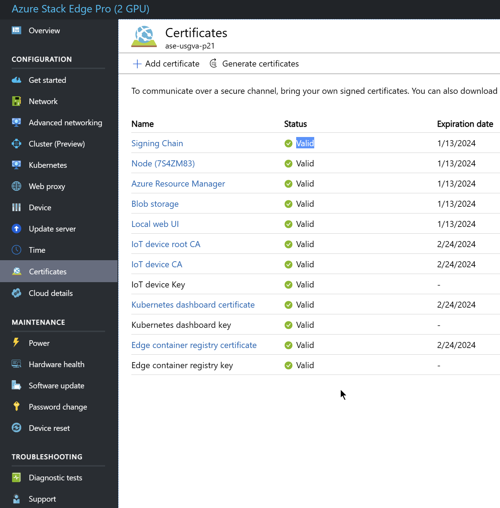
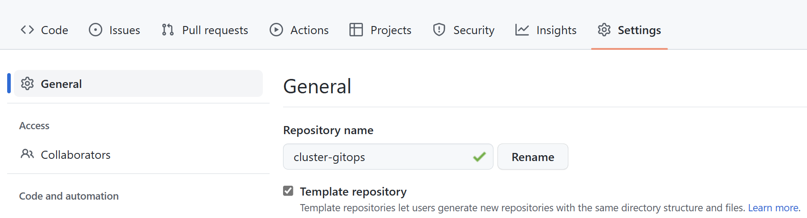
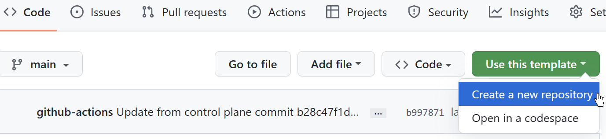

# Azure Arc with ASE

**Author:** Beijie Zhang
**Date:** 1/24/2023

## Overview

Azure Arc serves as a cloud and on-premises management platform to configure and monitor Arc enabled Kubernetes cluster (AKS) and cluster extensions. While an Azure Stack Edge (ASE) acts as a cloud storage gateway and enables eyes-off data transfers to Azure, while retaining local access to files. In an increasingly complex or disconnected environment, Azure Arc is ideal to govern the scaled and/or disconnected environments. By using Arc to bootstrap flux on a Edge cluster, it can monitor GitOps repo and provision deployments as needed.

The following Azure Arc management documentation will discuss components and integration steps. This guidance is specific to the Cloud Native control-plane implementation which can operate in connected cloud, edge, disconnected and air-gapped environments. This document will include sample pvc file that must be replaced with existing GitOps repo as the GitOps repo is normally designed for Azure Kubernetes Service.

## Components

**Azure Stack Edge** is a hardware device designed for disconnected and air-gapped environments. The ASE acts as a cloud storage gateway and enables eyes-off data transfers to Azure, while retaining local access to files.
**Azure Arc** serves as a cloud and on-premises management platform to configure and monitor Arc enabled Kubernetes cluster (AKS) and cluster extensions. When Arc is attached to a Kubernetes cluster on a Stack Edge device, it allows user to monitor and modify cluster configuration such as extensions and GitOps-based configuration management.
**GitOps repo** is a Git repository that contains the declarative descriptions of the infrastructure currently desired in the specified environment such as helm charts and patching overrides.

## Azure Arc enabled Edge Cluster Integration

### Prerequisites

- Have an edge device set up, with valid certificates 
- Able to connect to the device via PowerShell
- Device configured and gateway accessible via Azure portal (Needed for cloud storage share creation)
- Deployer Machine Setup complete
- Have Device required VPN set up

### Steps

  1. Create a kubernetes cluster via [create-kubernetes-cluster](https://learn.microsoft.com/en-us/azure/databox-online/azure-stack-edge-gpu-create-kubernetes-cluster)
  2. Login to azure account in terminal, set the right AZ environment
  3. Create a service principal and assign role to allow the Arc creation

        ``` bash
        export ROLE_NAME=<role_name>
        export SUBSCRIPTION_ID=<subscription_id>
        export RG_NAME=<resource_group_name>

        az ad sp create-for-rbac --name $ROLE_NAME

        az role assignment create --role 34e09817-6cbe-4d01-b1a2-e0eac5743d41 --assignee <app_ID_from_role_output> --scope /subscriptions/$SUBSCRIPTION_ID/resourceGroups/$RG_NAME
        ```

        Note: Depending on your access permission, this step might need to be completed by an Admin
  4. Install Arc on the device by running Powershell as admin, and run

        ```bash
        Winrm quickconfig
        $Name = "7s4zm83.missionready.local"
        Set-Item WSMan:\localhost\Client\TrustedHosts $Name -Concatenate -Force
        $sessOptions = New-PSSessionOption -SkipCACheck -SkipCNCheck -SkipRevocationCheck
        Enter-PSSession -ComputerName $Name -Credential ~\EdgeUser -ConfigurationName Minishell -UseSSL -SessionOption $sessOptions
        ```

        Enter device password as prompted

        ```bash
        Set-HcsKubernetesAzureArcAgent -SubscriptionId "<subscription_id>" -ResourceGroupName "<resource_group_name>" -ResourceName "<arc_resource_name>" -Location "<rg_region>" -TenantId "<service_principal_tenant_id>" -ClientId "<service_principal_app_id>" -CloudEnvironment AZUREUSGOVERNMENTCLOUD -Force
        ```

  5. Make a copy repo of the existing GitOps repo created from the control plane. This repo will be used for ASE flux deployment and it will be detached from the original control plane by design. This can be done by first making the GitOps repo as a `template repository` and select "Use this template"



  1. Created a SMB file share on ASE in Azure portal.

     1. Search for Azure Stack Edge in the Azure portal
     2. Select the ASE device -> `Cloud Storage Gateway` -> `Users`
     3. Create a user, save the credentials
     4. Click on `Shares` -> `Add Share`
     5. Create the share. Enter share name, select `SMB` type, toggle `Use the share with Edge compute: true`, `Configure as Edge local share: true; select Existing user and use the user created in last step
     6. Click `Mount` to mount the share to the device

     For more information, see Microsoft doc [here](https://learn.microsoft.com/en-us/azure/databox-online/azure-stack-edge-gpu-kubernetes-storage). Save the share name and User credentials

  2. Modify the `storageClassName` and `volumeName` values to create pv and pvc on the device itself
    Due to the different workspace and cluster name folder structure, the list of files will change. The list of files can be fetched by running the following command on the newly cloned GitOps repo's root path:

        ```bash
        grep -nr storageClassName ./
        grep -nr volumeName ./
        ```

        storageClassName will have a value of `ase-node-local` and volumeName will be the Cloud Storage Gateway share name created in step 6. See the example [any_pvc.yaml](any_pvc.yaml) for more information

  3. Install flux extension on the Arc instance using steps in [azure-arc-and-aks doc](../design-decisions/azure-arc-and-aks.md#azure-arc-enabled-cluster-integration)

  4. In local machine, run the following command from a **non-admin** powershell terminal to mount the SMB share to a Windows machine, for example:

        ```bash
        net use Z: \\ase-usgva-p21.missionready.local\<storage_gateway_share_name>\validation "<enter password>" /user:"<enter user>"
        ```

        User and password are credentials created from Cloud Storage Gateway user creation in step 6

  5.  Done, drop a file into the mounted share folder locally and verify processing workflow and logs

## Notes

In order for Arc to integrate with ASE correctly, few items should be noted

- The device cannot have expired certificates. Contact device admin to renew the certs if expired
- `Set-HcsKubernetesAzureArcAgent` command in step 4 might take some time to provision. If no resources are created, check if the `CloudEnvironment` is the correct value: `AZUREPUBLICCLOUD` or `AZUREUSGOVERNMENTCLOUD`
- This workflow will detach GitOps repo from its control-plane one. This is by design for a disconnected environment, therefore all following updates to the application infra needs to be made manually

## References

- Azure Arc overview: <https://learn.microsoft.com/en-us/Azure/azure-arc/kubernetes/overview>
- Enable Azure Arc on Kubernetes cluster on ASE: <https://learn.microsoft.com/en-us/azure/databox-online/azure-stack-edge-gpu-deploy-arc-kubernetes-cluster>
- Kubernetes storage management on ASE: <https://learn.microsoft.com/en-us/azure/databox-online/azure-stack-edge-gpu-kubernetes-storage>
