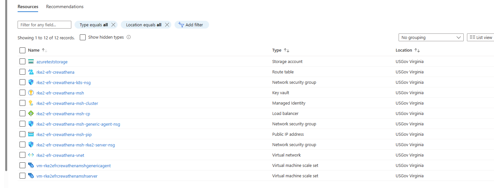
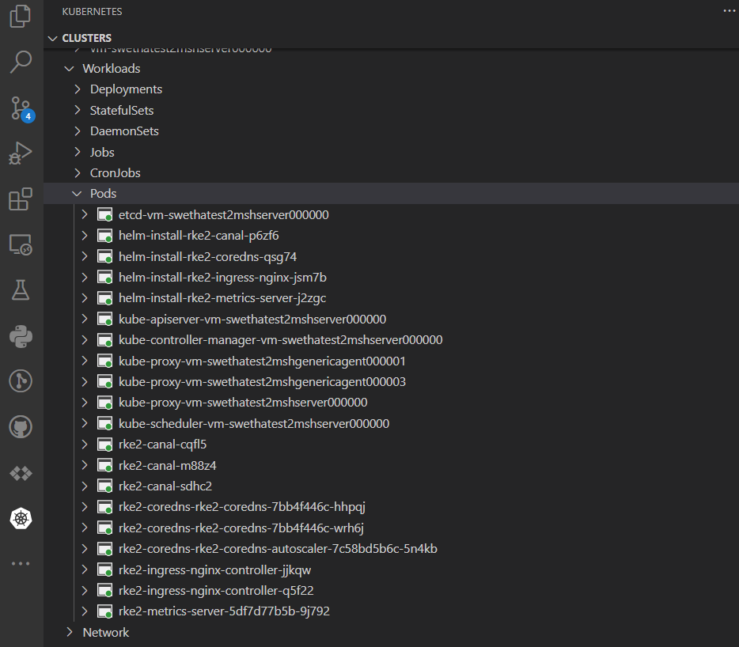

# RKE2 Kubernetes distribution

**Author:** Swetha Anand
**Date:** 1/20/2023

## Overview

[RKE2](https://docs.rke2.io/), also known as RKE Government, is Rancher's next-generation Kubernetes distribution.It focuses on security and compliance withing the U.S Federal Government sector.

## Install

For Installing the RKE2 on Azure, [rancherfederal/rke2-azure-tf](https://github.com/rancherfederal/rke2-azure-tf) which is a [terraform](https://www.terraform.io/) based repo can be used.

Steps to deploy RKE2 on Azure using this above repo

```bash
git clone <above repo>
open in devcontainer
az login
az account set --subscription <subscriptionname>
az account show
cd examples/quickstart
terraform init
terraform apply -auto-approve
```

This repo scripts creates RKE VM's , KeyVault, Managed Identity, LoadBalancer, Public IP address, vnet's as shown below



In order to view the pods the repo contains a fetch-kubeconfig.sh script when run fetches the kubeconfig file. Once the kubeconfig is retrived the pods can be viewed by `kubectl get pods -A`or by using the kubernetes extension in vscode as below



In order to attach the storage account that is required for the netobs solution, the storage account can be added to this resource group by using the same terraform repo and adding the code to support it or it can be added from the Azure Portal associating to the same resource group name of RKE2 cluster.

Below is a example of adding the storage account resource to the terraform script.

```bash
data "azurerm_resource_group" "rg" {
  name = "rke2-efr-crewathena"
}

resource "azurerm_storage_account" "example" {
  name                     = "azureteststorage"
  resource_group_name      = data.azurerm_resource_group.rg.name
  location                 = data.azurerm_resource_group.rg.location
  account_tier             = "Standard"
  account_replication_type = "LRS"
}

resource "azurerm_storage_share" "example" {
  name                 = "sharename"
  storage_account_name = azurerm_storage_account.example.name
  quota                = 50
}

resource "azurerm_storage_share_file" "example" {
  name             = "test.zip"
  storage_share_id = azurerm_storage_share.example.id
  source           = "test.zip"
}
```

## References

- Terraform: https://www.terraform.io/
- Azurerm: https://learn.microsoft.com/en-us/azure/developer/terraform/provider-version-history-azurerm
- Creating storage using terrafom azurerm: https://registry.terraform.io/providers/hashicorp/azurerm/latest/docs/resources/storage_share_file
- Resources for Azurerm: https://registry.terraform.io/providers/hashicorp/azurerm/latest/docs/resources/public_ip
