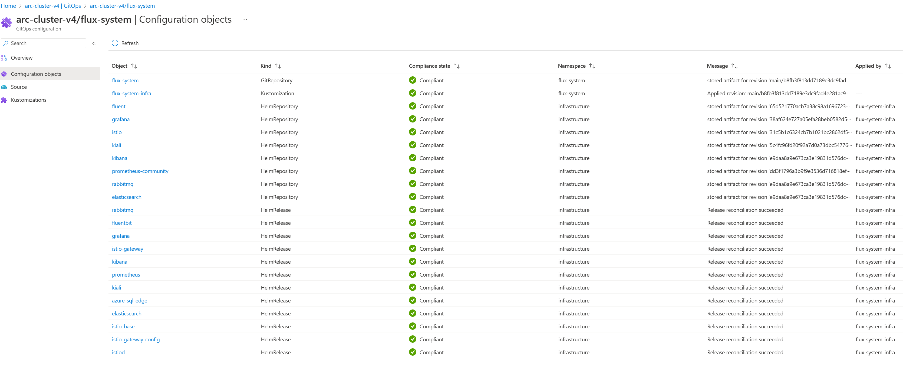

# Azure Arc with Flux and AKS Cluster

**Author:** Beijie Zhang
**Date:** 1/13/2023

## Overview

Azure Arc serves as a cloud and on-premises management platform to configure and monitor Arc enabled Kubernetes cluster(AKS) and cluster extensions. While an AKS cluster can be managed locally via kubectl, in an increasingly complex or disconnected environment, Azure Arc is ideal to govern the scaled and/or disconnected environments. By using Arc to bootstrap flux, it can monitor GitOps repo and provision deployments as needed.

The following Azure Arc management documentation will discuss components and integration steps. This guidance is specific to the Cloud Native control-plane implementation which can operate in connected cloud, edge, disconnected and air-gapped environments.

## Components

**Azure Arc** serves as a cloud and on-premises management platform to configure and monitor Arc enabled Kubernetes cluster(AKS) and cluster extensions. When Arc is attached to a Kubernetes cluster(AKS), it allows user to monitor and modify cluster configuration such as extensions and GitOps-based configuration management.
**Flux** is a tool for keeping AKS clusters in sync with sources of configuration such as a GitOps repo, and automating updates to configuration when there is new code or updates to deploy. Flux can be installed as a cluster extension via Azure Arc to provide repo syncing.
**GitOps repo** is a Git repository that contains the declarative descriptions of the infrastructure currently desired in the specified environment such as helm charts and patching overrides.

## Azure Arc enabled Cluster Integration

1. Follow the [Coral steps](https://github.com/microsoft/coral/blob/main/docs/cluster-registration.md#provisioning-a-kubernetes-cluster) to provision an AKS cluster. Stop at the "bootstrap Flux" step as it will be done via Azure Arc instead. Save the cluster name and resource group.

    ```bash
    export CLUSTER_NAME=<cluster_name>
    export RESOURCE_GROUP=<resource_group>
    ```

2. Connect Azure Arc to the cluster

    ```bash
    az extension add -n k8s-configuration
    az extension add -n k8s-extension

    az provider register --namespace Microsoft.Kubernetes
    az provider register --namespace Microsoft.ContainerService
    az provider register --namespace Microsoft.KubernetesConfiguration

    az connectedk8s connect --name $CLUSTER_NAME --resource-group $RESOURCE_GROUP
    ```

3. Install flux with linked GitOps repo

    ```bash
    export GITOPS_REPO_URL=<gitops-repo-url> # ex: https://github.com/owner/gitops-repo
    export INFRA_PATH=<path-to-infra-cluster-directory> # Locate this path in GitOps repo. ex: ./clusters/<cluster-name>/coral-system/ManifestDeployments
    export APP_PATH=<path-to-app-cluster-directory> # Locate this path in GitOps repo. ex: ./clusters/<cluster-name>/<workspace-name>/ApplicationRegistrations/

    az k8s-configuration flux create -g $RESOURCE_GROUP \
    -c $CLUSTER_NAME \
    -n flux-system \
    --namespace flux-system \
    -t connectedClusters \
    --scope cluster \
    -u $GITOPS_REPO_URL \
    --branch main  \
    --kustomization name=infrastructure path=$INFRA_PATH prune=true \
    --kustomization name=app path=$APP_PATH prune=true
    ```

4. Disable multi-tenancy to allow cross namespace resource reference

    ```bash
    az k8s-extension update --configuration-settings multiTenancy.enforce=false -c $CLUSTER_NAME -g $RESOURCE_GROUP -n flux -t connectedClusters
    ```

5. Done! Post deployments flux will be installed as an extension and configuration objects should reconciliate successfully and will auto sync with any GitOps repo changes.




## Notes

In order for Arc to integrate with Flux correctly, few items should be noted

- ARC installs Flux with multi-tenancy enabled which disables referencing resources across namespaces. This can be overridden post flux extension creation in step 4 above.
- The names given to the command to install Flux through ARC actually also internally set the names of the Flux GitRepository object. Therefore the `name` and `namespace` in step 3 must also be flux-system.
- The kustomization paths must point to the cluster paths instead of the base kustomization path. Make sure the path value starts with `./clusters/...`.

## References

- Azure Arc overview: <https://learn.microsoft.com/en-us/Azure/azure-arc/kubernetes/overview>
- Connecting Azure Arc to AKS: <https://learn.microsoft.com/en-us/azure/azure-arc/kubernetes/quickstart-connect-cluster?tabs=azure-cli>
- Deploy applications using GitOps with Flux: <https://learn.microsoft.com/en-us/azure/azure-arc/kubernetes/tutorial-use-gitops-flux2?tabs=azure-cli>
