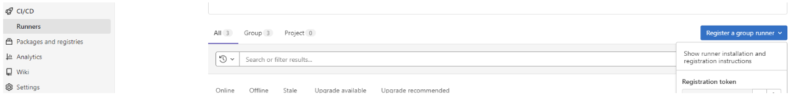
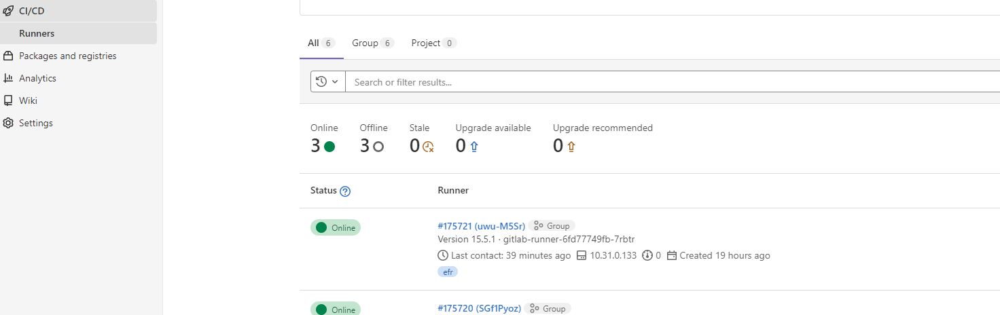

# Runner for GitLab Pipelines

**Author:** Swetha Anand
**Date:** 1/9/2023

## Overview

GitLab requires a runner to run the CI/CD jobs in a pipeline. [GitLab Runner](https://docs.gitlab.com/runner/) is an application that could be used to run the jobs. The GitLab Runner can be installed in many ways, the below approach refers to installing the GitLab Runner using helm charts. More details on installation guide for GitLab Runner can be found [here](https://docs.gitlab.com/runner/install/kubernetes.html)

## Prerequistes

- AKS cluster. More details to Spin up an AKS cluster can be found [here](https://learn.microsoft.com/en-us/azure/aks/learn/quick-kubernetes-deploy-portal?tabs=azure-cli)
- GitLab account.

### Steps for creating a GitLab Runner using [values.yaml](https://docs.gitlab.com/runner/install/kubernetes.html#configuring-gitlab-runner-using-the-helm-chart) file using helm approach

- Set the local kube config file to use the above created AKS resource and create a namespace for GitLab Runner

```bash
az login
az account set --subscription <subscriptionid>
az aks get-credentials --resource-group <rg name> --name <aks cluster name>
kubectl get pods -A
kubectl create namespace gitlab-runner
```

- Next, Create a values.yaml in your local. Sample can be found [here](https://gitlab.com/gitlab-org/charts/gitlab-runner/-/blob/main/values.yaml)
- Configure the below values in your local values.yaml

```bash
replicas: <number of replicas>
gitlabUrl: <gitlab-host-for-the-gitlab-runner> #ex:https://gitlab.com/
runnerRegistrationToken: "runner-registration-token" 
rbac:
  create: true
runners:
  config: |
    [[runners]]
      [runners.kubernetes]
        namespace = "{{.Release.Namespace}}"
        image = "ubuntu:20.04"
        privileged = true
      [[runners.kubernetes.volumes.empty_dir]]
        name = "docker-certs"
        mount_path = "/certs/client"
        medium = "Memory"
 tags: "runner-tag" #ex:abcrunner
```

> **Note:**  Group runner registration tokens can be found under https://gitlabhost.com/--groups--/-/runners , each group will be associated with its own registration token
> **Note:**  You need to have `OWNER` permissions for the group to obtain the group runner registration tokens



Refer to the link in references below for more information on types of GitLab Runners.

### Installing GitLab Runner using the above local values.yaml with `helm install`

``` bash
cd to <dir/to/values.yaml>
helm install --namespace <gitlabnamespace> gitlab-runner gitlab/gitlab-runner -f values.yaml
```

Once the runners are sucessfully installed they can be verified under group/CICD/Runners as below



### Upgrading a GitLab Runner

To upgrade the helm deployment, uninstall the GitLab Runner using `helm uninstall`, make changes to values.yaml and redeploy it using the above steps

```bash
helm uninstall gitlab-runner --namespace <gitlabnamespace>
```

## Using the GitLab Runner in your workflow for CI-CD

In the CI-CD workflow file for your project (gitlab-ci.yaml) add the tags as below to use the gitlab runner created:

```bash
build-dotnet-seed:
  stage: build
  tags:
    - <runner-tag> #ex:abcrunner
docker-build-and-push:
  stage: push
  tags:
    - <runner-tag> #ex:abcrunner
  image: docker:19.03.12
  variables:
    DOCKER_HOST: tcp://docker:2376
    DOCKER_TLS_CERTDIR: "/certs"
    DOCKER_TLS_VERIFY: 1
    DOCKER_CERT_PATH: "$DOCKER_TLS_CERTDIR/client"
    TAG_NAME: latest
  services:
    - docker:19.03.13-dind 
```

More info on configuring these values can be found [here](https://archives.docs.gitlab.com/14.8/ee/ci/docker/using_docker_build.html#use-docker-in-docker)

## References

GitLab Installation: https://docs.gitlab.com/runner/install/ 

Types of GitLab Runner: https://docs.gitlab.com/runner/#who-has-access-to-runners-in-the-gitlab-ui 

Features of GitLab Runner: https://docs.gitlab.com/runner/#features 

Runner configuration: https://archives.docs.gitlab.com/14.8/ee/ci/docker/using_docker_build.html#use-docker-in-docker 

Configuring Runner Volumes: https://docs.gitlab.com/runner/executors/kubernetes.html#using-volumes 
