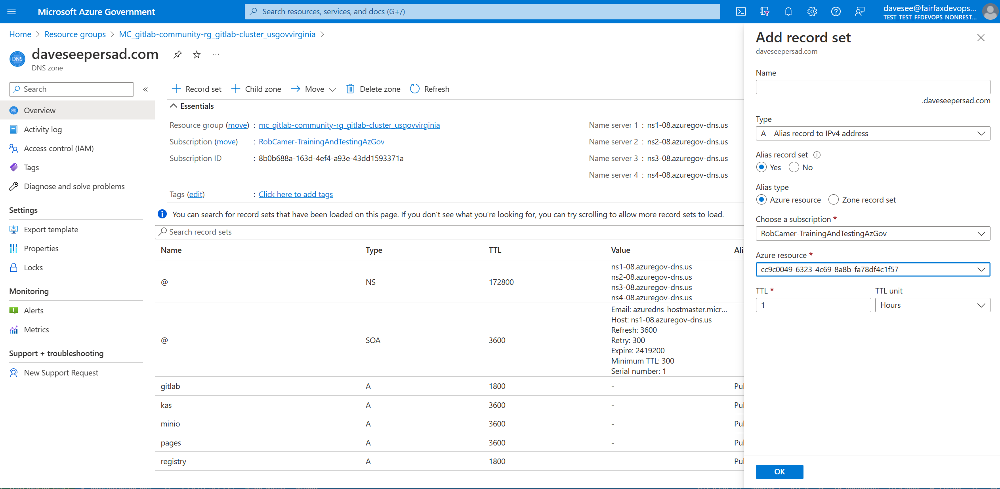

# GitLab Using Helm

**Authors** Swetha Anand, Dave Seepersad
**Date:** 1/13/2023

## Overview

[GitLab](https://gitlab.com/gitlab-org/gitlab) is an open source end-to-end software development platform with built-in version control, issue tracking, code review, CI/CD. This document will cover the deployment of a non-production GitLab server on an Azure AKS cluster.

## Pre-Requisites

### AKS Instance

GitLab provides a basic deployment script for an AKS cluster in their Helm chart repo's [scripts folder](https://gitlab.com/gitlab-org/charts/gitlab/-/blob/master/scripts/aks_bootstrap_script.sh). This script suggests a 2 node, Standard_D4s_v3 cluster node configuration and a Public IP at a minimum. Use this script or any preferred method to create the AKS instance and an associated Public IP address.

### Deployment Domain

The default GitLab helm chart produces several subdomain URLs under the main domain (gitlab, registry, minio and kas). To facilitate this, a dedicated domain name and the relevant DNS Zone entries are required. If only the main gitlab URL is required, the `AKS Public IP Address > Configuration > DNS Name Label` can be used (this was not tested, please update this document if completed successfully).

If you do have a domain to use, follow these steps:

- Create an Azure DNS Zone in the same resource group as the AKS nodes and the Public IP
- Update your Domain's nameservers to point to the 4 Azure nameservers present in the DNS Zone Overview
- Add Alias Record Sets for gitlab, registry, minio and kas (add or remove any based on your helm chart configuration) which point to the AKS's Public IP



### Email Account

If you would like to set up email notifications, an account will have to be available. There are several email account types that will work, they are all listed in the GitLab [SMTP Settings](https://docs.gitlab.com/omnibus/settings/smtp.html) documentation. This installation uses a new `outlook.com` account, create one if you would like to install it. Please note the Username and Password to be used in the installation step.

The GitLab SMTP Settings provided for Outlook include the following values. These will be set during the Helm install. Sending a test email will be covered after the installation.

```bash
# Outlook
gitlab_rails['smtp_enable'] = true
gitlab_rails['smtp_address'] = "smtp-mail.outlook.com"
gitlab_rails['smtp_port'] = 587
gitlab_rails['smtp_user_name'] = "username@outlook.com"
gitlab_rails['smtp_password'] = "password"
gitlab_rails['smtp_domain'] = "smtp-mail.outlook.com"
gitlab_rails['smtp_authentication'] = "login"
gitlab_rails['smtp_enable_starttls_auto'] = true
gitlab_rails['smtp_openssl_verify_mode'] = 'peer'
```

>**Note** This step can be completed later, however new account creation by default sends a verification email to the account email. If email is not configured, emails will have to be verified manually in the GitLab UI (this is a simple process).

### WSL Dev Setup

The deployment itself will be done on a WSL Ubuntu instance with the following applications installed:

- [Azure CLI](https://learn.microsoft.com/en-us/cli/azure/install-azure-cli)
- [Kubectl](https://kubernetes.io/docs/tasks/tools/#kubectl)
- [Helm](https://helm.sh/docs/intro/install/)

## Installation

Login to the Azure subscription and connect to the AKS cluster, create the namespace and email-password secret, then install the server's Helm chart.

We will use the official GitLab Server [Helm chart](https://gitlab.com/gitlab-org/charts/gitlab/-/tree/master/charts/gitlab) to deploy to the cluster. Several parameters are required for the deployment, adjust as needed for your deployment scenario.

```bash
# Access the cluster and create a dedicated namespace
az login
az account set --subscription <subscriptionid>
az aks get-credentials --resource-group <rg name> --name <aks cluster name>
kubectl get pods -A
kubectl create namespace gitlab-server
kubectl config set-context --current --namespace=gitlab-server

# Create the Outlook email password secret
kubectl create secret generic gitlab-outlook-secret --from-literal=password=<outlook-password>

# Add Helm repo to your local terminal
helm repo add gitlab https://charts.gitlab.io/
helm repo update

# Deploy the GitLab Server chart
helm upgrade --install gitlab gitlab/gitlab --timeout 600s \
 --set global.hosts.externalIP=<external-ip-address> \ # eg. 111.111.111.111
 --set global.hosts.domain='<root-domain>' \             # eg. daveseepersad.com
 --set certmanager-issuer.email='<any-email>' \          # eg. gitlab.daveseepersad@outlook.com
 --set postgresql.image.tag=13.6.0 \                   # get latest from the Helm instructions
 --set global.edition=ce \
 --set gitlab-runner.runners.privileged=true \         # include the rest if configuring email
 --set global.smtp.enabled=true \
 --set global.smtp.address='smtp-mail.outlook.com' \
 --set global.smtp.port=587 \
 --set global.smtp.user_name='<outlook-email>' \       # eg. gitlab.daveseepersad@outlook.com
 --set global.smtp.password.secret='gitlab-outlook-secret' \
 --set global.smtp.password.key='password' \
 --set global.smtp.domain='smtp-mail.outlook.com' \
 --set global.smtp.authentication='login' \
 --set global.smtp.starttls_auto=true \
 --set global.smtp.openssl_verify_mode='peer' \
 --set global.email.from='<outlook-email>' \
 --set global.email.reply_to='<outlook-email>'
```

## Post Installation

The installation itself should be complete in roughly one to two minutes to the AKS cluster. The GitLab website itself may take a few minutes to resolve to the `https://gitlab.<your-domain.com>` URL, however the Self Signed Let's Encrypt certificates may take up to 24 hours to be created. 

> **Warning** The incomplete SSL does produce an error with GitLab Runner registrations, so these may fail until the certificates are generated.

Proceed to the gitlab host URL and use the username `root` and the password retrieved in the below commands to enter the instance. Additional commands are provided for convenience.

Kubernetes commands of interest:

```bash
# Get GitLab subdomain hosts
kubectl get ingress

# Get GitLab root password (default account and login)
kubectl get secret gitlab-gitlab-initial-root-password -ojsonpath={.data.password} | base64 --decode ; echo

# SSL Certificates Status
kubectl get certificates
kubectl describe certificate gitlab-gitlab-tls

######################################################
# Increase the number of default GitLab Runners
kubectl edit deployment gitlab-gitlab-runner
# Edit the following to the desired number of runners
  replicas: 1
# Save by clicking `Esc` then typing :wq and Enter
# The new runners will be created
# Remove decommissioned runners from the UI if necessary
# (This was not able to be set during the Helm install step)

######################################################
# Use the GitRails CLI to send a test notification email
# The GitLab CLI docs: https://docs.gitlab.com/ee/administration/operations/rails_console.html
k get pods | grep toolbox
<gitlab-toolbox-uid>                    1/1     Running     0               28h

kubectl exec --stdin --tty <gitlab-toolbox-uid> -- /bin/bash

Defaulted container "toolbox" out of: toolbox, certificates (init), configure (init)
git@gitlab-toolbox-55c76cfd94-c9s5m:/$ gitlab-rails console
--------------------------------------------------------------------------------
 Ruby:         ruby 2.7.7p221 (2022-11-24 revision 168ec2b1e5) [x86_64-linux]
 GitLab:       15.7.3 (af275d7430d) FOSS3
 GitLab Shell: 14.14.0
 PostgreSQL:   13.6
------------------------------------------------------------[ booted in 15.31s ]
Loading production environment (Rails 6.1.6.1)
irb(main):001:0> Notify.test_email('<your@email.com>', 'GitLab Test', 'GitLab email test body.').deliver_now

# Outputs error message or success header
```

## Updates

You can re-run the same `helm upgrade --install ...` command with different variables and Helm will create a new release for each successful configuration. The new pods and resources will be spun up for changes requested and the old resources deleted. This is a zero downtime update and does not cause any data loss with the deployment.

The default GitLab Runner count however was not set by the helm command (if this can be figured out that would be a great contribution), the Runner deployment replica count would have to be edited again and the defunct runners removed from your GitLab Runners UI  at your  https://<gitlab.domain.com>/admin/runners.

## Upgrades

To update the version of GitLab itself, complete the following steps:

Find the latest chart number (left column) here, https://docs.gitlab.com/charts/installation/version_mappings.html.

```bash
# Export the current deployment's values set from the current working version
helm get values gitlab > gitlab.yaml

helm upgrade gitlab gitlab/gitlab \
  --version 6.8.0 \
  -f gitlab.yaml \
  --set gitlab.migrations.enabled=true

Release "gitlab" has been upgraded. Happy Helming!
...

# Reset the number of default runners to 3 as described previously
kubectl edit deployment gitlab-gitlab-runner
```

## Removal

The Helm chart can be removed by running the command `helm uninstall gitlab`. Additionally the namespace can also be removed to clean up any residual resources.

> **Note** If the SSL certificates are in a pending state they may not be deleted immediately. This would also prevent the namespace removal. This causes a problem when redeploying to the same cluster into a different namespace. The deployment fails because the certificates can only exist as a singleton resource cluster wide. You will have to wait for the certificate request to fail (could be hours) or spin up a new AKS cluster.

## References:

- https://docs.gitlab.com/charts/installation/deployment.html
