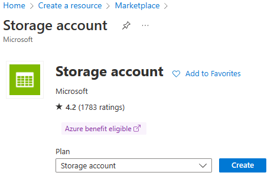
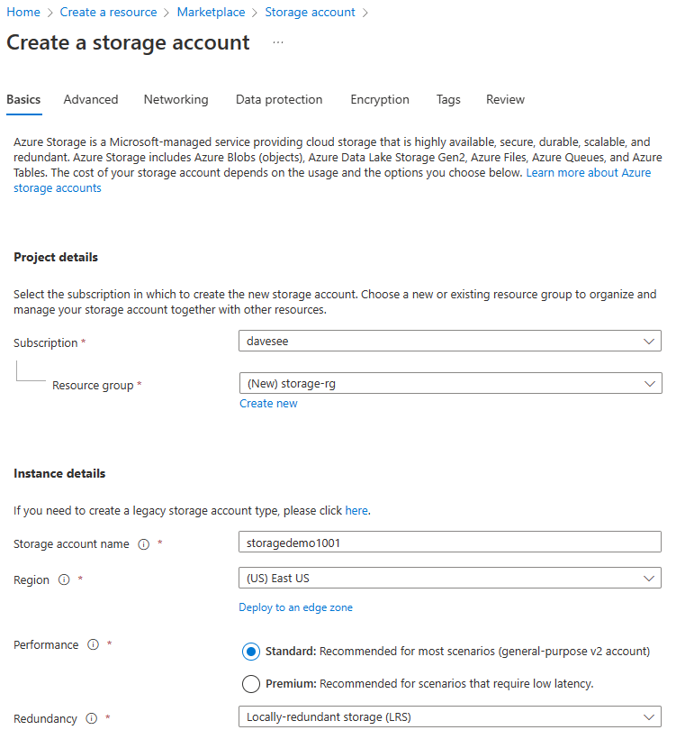
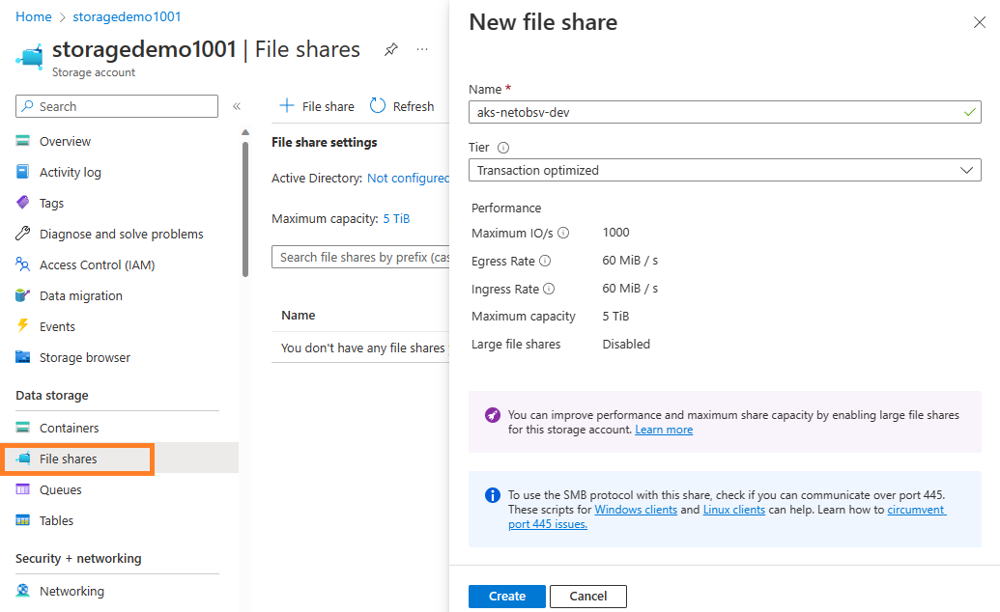

# Storage - Azure File Share

**Author:** Dave Seepersad
**Date:** 12/14/2022

## Overview

Provisioning of storage to deployments is a foundational component of Kubernetes infrastructure capability. These can be dynamic which are created and destroyed with the pod, or persistent which can be retained after the pod is removed. Storage classes installed on the cluster facilitate these volumes. They can be created in memory or backed by a physical storage medium.

The following storage management documentation is specific to the Azure FileShare which is natively available to the Azure Kubernetes Service (AKS) through the `azurefile-csi` storage class.

For more information, please review the official [Azure CSI File Share](https://learn.microsoft.com/en-us/azure/aks/azure-files-csi) and [Kubernetes Storage](https://kubernetes.io/docs/concepts/storage/) documentation.

## Azure File Share

The first component required is the Azure File Share itself. A basic share will be used to illustrate. Several methods may be used to create this resource, however to keep things simple, we will use the Azure Portal UI. 

First, let's create the storage account. We will use the defaults, but please secure and modify to meet your requirements. 

> **Note:** this can be created in a dedicated resource group and accessed from multiple AKS instances.





All other settings were left as default values and the Storage Account was created. It is recommended to remove public access and add the network for the AKS cluster to ensure dedicated use.

Next, create the File Share.



Finally, retrieve the Access Key for the Storage Account.


## Kubernetes Storage

The in this example, we will be provision the storage to the istio-service application deployments. In our use case, each service deployment connects to the same storage to process uploaded network files through a series of folders until completion.

To facilitate this, each application deployment will receive its own Persistent Volume Claim (PVC) in it's unique deployment namespace. 

> **Important:** PVC's and secrets can only be accessed by resources in the same namespace.

The PVC deployment has two dependencies:

- A [Kubernetes Secret](https://kubernetes.io/docs/concepts/configuration/secret/) containing the Access Key credentials
- A [Kubernetes Persistent Volume](https://kubernetes.io/docs/concepts/storage/persistent-volumes/) for the claim to attach unto

The secret contains two pieces of data:

-  azurestorageaccountkey
-  azurestorageaccountname

> **Warning:** Adding sensitive data poses a security risk. Please follow the [SOPS documentation](secret-management.md) to securely encrypt this and all other sensitive information in the solution.

```yaml
apiVersion: v1
kind: Secret
metadata:
  name: azure-secret
  namespace: {{coral.workspace}}-{{coral.app}}
type: Opaque
data:
  azurestorageaccountkey: <access-key>            # eg. aaaaaaaaaaAAAAAAAAAA1111111111AAAAAAAAAAaaaaaaaaaaAAAAAAAAAAaaaaaaaaaaAAAAAAAAAAaaaaaa==
  azurestorageaccountname: <storage-account-name> # eg. Aaaaaaaaaaaa==
```

Note that the above two values need to be base64 encoded. Encoded values can be obtained by piping the string literal into base64. For example, if your storage account is called "mystorageaccount", run

```bash
% echo -n 'mystorageaccount' | base64
% bXlzdG9yYWdlYWNjb3VudA==
```

The Persistent Volume is also created, referring to the secret with nodeStageSecretRef, and reserving itself for the PVC with the claimRef.

Source - [Azure CSI driver Option 2](https://github.com/kubernetes-sigs/azurefile-csi-driver/blob/master/deploy/example/e2e_usage.md#option2-pvpvc)

```yaml
apiVersion: v1
kind: PersistentVolume
metadata:
  name: {{coral.workspace}}-{{coral.app}}-pv
  namespace: {{coral.workspace}}-{{coral.app}}
spec:
  capacity:
    storage: 100Gi
  accessModes:
    - ReadWriteMany
  persistentVolumeReclaimPolicy: Delete
  storageClassName: azurefile-csi
  claimRef:                                         # prevents other deployments from using this PV
    name: dotnet-pvc                                # must match the PVC name
    namespace: {{coral.workspace}}-{{coral.app}}
  csi:
    driver: file.csi.azure.com
    readOnly: false
    volumeHandle: {{coral.workspace}}-{{coral.app}} # same name as app to satisfy the volumeHandle's uniqueness requirement
    volumeAttributes:
      resourceGroup: <storage-rg-name>              # eg. storage-rg
      storageAccount: <storage-account-name>        # eg. storagedemo1001
      shareName: <file-share-name>                  # eg. aks-netobsv-dev
    nodeStageSecretRef:
      name: azure-secret                            # name of the secret created above
      namespace: {{coral.workspace}}-{{coral.app}}
  mountOptions:
    - dir_mode=0777
    - file_mode=0777
    - uid=0
    - gid=0
    - mfsymlinks
    - cache=strict
    - nosharesock
    - nobrl
```

Finally the Persistent Volume Claim is created.

```yaml
apiVersion: v1
kind: PersistentVolumeClaim
metadata:
  name: dotnet-pvc # referenced by the deployment's `spec.template.spec.volumes[0].persistentVolumeClaim.claimName`
  namespace: {{coral.workspace}}-{{coral.app}}
spec:
  accessModes:
    - ReadWriteMany
  storageClassName: azurefile-csi
  volumeName: {{coral.workspace}}-{{coral.app}}-pv
  resources:
    requests:
      storage: 100Gi
```

The deployment itself must also be updated to include the storage volume with the reference to the PVC.

```yaml
apiVersion: apps/v1
kind: Deployment
metadata:
  name: {{name}}-deployment-{{version}}
  namespace: {{coral.workspace}}-{{coral.app}} # same namespace as the secret, PV and PVC
spec:
  ...
  template:
    ...
    spec:
      ...
      volumes:
      - name: datastore
        persistentVolumeClaim:
          claimName: dotnet-pvc                # PVC name
      containers:
      - name: {{coral.app}}
        image: {{image}}
        ...
        volumeMounts:
        - name: datastore
          mountPath: /var
```

## Alternatives Considered

It would also be possible to deploy all the App Team applications to one namespace, allowing reuse of one PVC to multiple deployments. This can be facilitated either in the templates folder as a new type of deployment or as an infrastructure manifest, provisioned by the Platform team. In the latter case, the namespace could be pre-created to match the workspace name and the deployment templates updated to deploy to this common namespace. These options have not been implemented or tested but are available for relevant use cases.