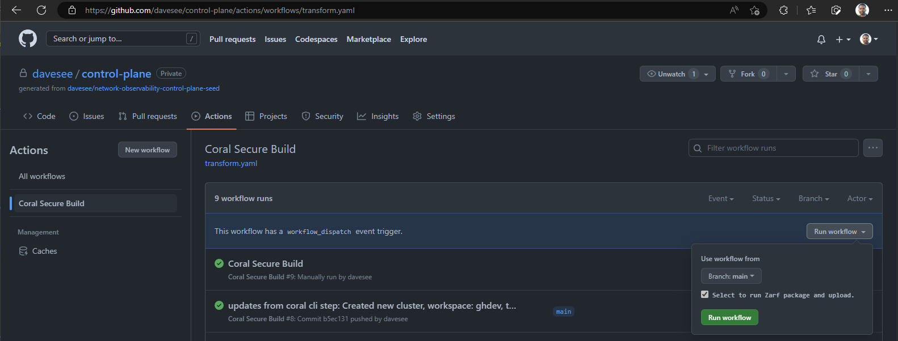

# Zarf Package and Upload

**Authors** Dave Seepersad
**Date:** 1/20/2023

## Overview

Zarf enables the packaging of kubernetes deployment manifests and their included images to a single file. Learn more about Zarf via their official [docs](https://docs.zarf.dev/docs/zarf-overview). This can be easily deployed to a Zarf initialized cluster for disconnected and air-gapped deployments. Zarf manifests for the coral-system resources are stored in the root `zarf` folder. Application manifests are included in their respective templates and are rendered/packaged along with the coral-system Zarf manifests as part of the pipeline, which also saves these Zarf packages to the provided Azure Storage account.

## Pre-Requisites

### Zarf manifests and templates

The Zarf manifests have to be created and added to the Coral seed. This can be done manually or created in the [Coral Zarf Dev Loop](https://github.com/crew-athena-org/coral-zarf-devloop). They should match the Flux Coral System deployments present in the root `manifests` folder as closely as possible. Main causes of variance account for Kubernetes cluster differences such as storage and networking capabilities.

Application templates which include `zarf.yaml` files will be created in the GitOps repo. These are temporarily copied over to the zarf folder during the pipeline package creation process for inclusion into the storage account container for the Zarf deployment assets.

### Zarf cluster

The packages can only be deployed to a [Zarf initialized](https://docs.zarf.dev/docs/user-guide/zarf-packages/the-zarf-init-package) cluster. Currently, there is a limitation with Azure AKS (older ContainerD version) which causes the initialization to fail, so another Kubernetes instance needs to be used. This does fit the disconnected model as Kind, K3D or RKE clusters can be deployed to bare metal or VMs.  

### Azure Storage Account

This storage account is used for storing the Zarf packages. The pipeline itself creates a Storage Account in the deploy step and becomes available to the pipeline via the `AZURE_CREDENTIALS` Service Principal login in the pipeline. The Storage account can be a different one if added into the repository secrets/variables as `STORAGE_ACCOUNT`, the SP used will need to have access to this as well.

## Implementation

To enable the Zarf package and upload, the Control Plane's `Coral Secure Build` pipeline must be manually started with the "Select to run Zarf package and upload" checkbox selected.

The pipeline calls two scripts: 

1. Installation of Zarf CLI to the runner `/scripts/pipeline/installZarf.sh`
2. The creation and upload of the packages `/scripts/pipeline/uploadZarf.sh`

The first script is a multi use Zarf deployment tool. It is called with the command parameters `-v v0.23.2 -t cli ` to specify the version of Zarf to use as well as to install the CLI action.

The second script:

- connects to the storage account
- creates a container with the unique name of the control plane and the job ID number (auto increments)
- copies Zarf manifests from the GitOps repo
- creates Zarf packages for each manifest found, one at a time
- uploads the Zarf packages to the container

## References

- https://docs.zarf.dev/docs/zarf-overview
- https://github.com/defenseunicorns/zarf
- https://github.com/kubernetes-sigs/kind 
- https://k3d.io/v5.4.6/
- https://github.com/rancherfederal/rke2-azure-tf