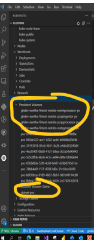
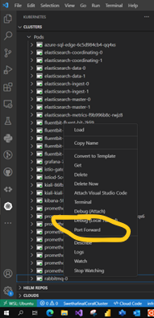
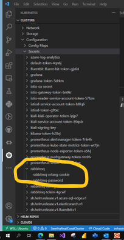
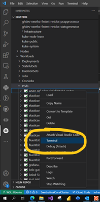
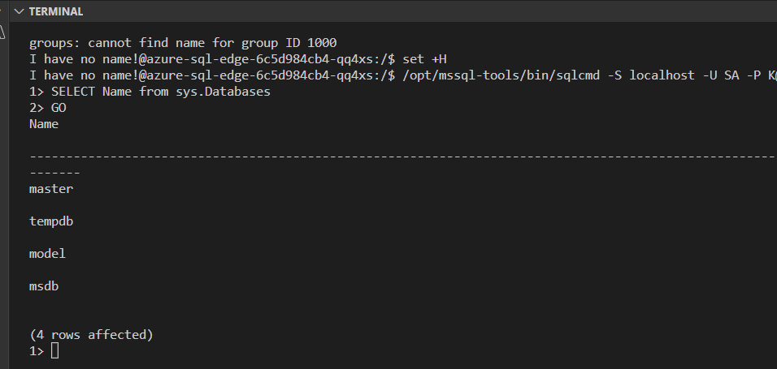
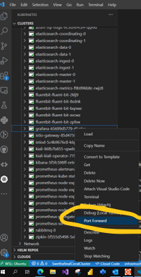

# Troubleshooting

**Author:** Marshall Bentley, Swetha Anand

**Date:** 1/4/2023

## Assess Cluster Status

One of the first steps to evaluate deployment issues is to assess the current status of the Kubernetes cluster from a Flux perspective.  The Flux status can be queried using the `flux get all -A` command.

```bash
$ flux get all -A
NAMESPACE       NAME                            REVISION        SUSPENDED       READY   MESSAGE                                                                      
flux-system     gitrepository/flux-system       main/89c2e77    False           True    stored artifact for revision 'main/89c2e77fe97fdd90086ae56cc9929df0e3dcdb16'

NAMESPACE       NAME                                    REVISION                                                                SUSPENDED       READY   MESSAGE                                                                                         
infrastructure  helmrepository/elasticsearch            72baee58ba9a5e48d2ed368ff0ce0d277b4fb51f90055418e9a61c61b7d747e3        False           True    stored artifact for revision '72baee58ba9a5e48d2ed368ff0ce0d277b4fb51f90055418e9a61c61b7d747e3'
infrastructure  helmrepository/fluent                   1258b3b4d57ebaa1f091fc5cd1835c49377ab9d1fafa7b6a44f2f5a855e89a2c        False           True    stored artifact for revision '1258b3b4d57ebaa1f091fc5cd1835c49377ab9d1fafa7b6a44f2f5a855e89a2c'
infrastructure  helmrepository/grafana                  4267f6e0377c02300f5de88747cdd07339b0a1d711dd4880b2fccd7ab95b8bf0        False           True    stored artifact for revision '4267f6e0377c02300f5de88747cdd07339b0a1d711dd4880b2fccd7ab95b8bf0'
infrastructure  helmrepository/istio                    3c2ddc9e2b23ea35db3cbc009c87e1dc6a4ec07f7c3a6b4b65d67a9bf38d3768        False           True    stored artifact for revision '3c2ddc9e2b23ea35db3cbc009c87e1dc6a4ec07f7c3a6b4b65d67a9bf38d3768'
infrastructure  helmrepository/kiali                    90851f0394b5367382dffb5556a4e7cd580a87e1e7a9f7c77d37b0a264c65430        False           True    stored artifact for revision '90851f0394b5367382dffb5556a4e7cd580a87e1e7a9f7c77d37b0a264c65430'
infrastructure  helmrepository/kibana                   72baee58ba9a5e48d2ed368ff0ce0d277b4fb51f90055418e9a61c61b7d747e3        False           True    stored artifact for revision '72baee58ba9a5e48d2ed368ff0ce0d277b4fb51f90055418e9a61c61b7d747e3'
infrastructure  helmrepository/prometheus-community     9e6e68e61c6ab2c0a6b58549683924867a23436ddf5832b4f569143fd2fe56dd        False           True    stored artifact for revision '9e6e68e61c6ab2c0a6b58549683924867a23436ddf5832b4f569143fd2fe56dd'
infrastructure  helmrepository/rabbitmq                 72baee58ba9a5e48d2ed368ff0ce0d277b4fb51f90055418e9a61c61b7d747e3        False           True    stored artifact for revision '72baee58ba9a5e48d2ed368ff0ce0d277b4fb51f90055418e9a61c61b7d747e3'

NAMESPACE       NAME                                            REVISION        SUSPENDED       READY   MESSAGE                                                    
flux-system     helmchart/infrastructure-azure-sql-edge         0.1.0           False           True    packaged 'azure-sql-edge' chart with version '0.1.0'      
flux-system     helmchart/infrastructure-istio-gateway-config   1.0.0           False           True    packaged 'istio-gateway-config' chart with version '1.0.0'
infrastructure  helmchart/infrastructure-elasticsearch          19.4.0          False           True    pulled 'elasticsearch' chart with version '19.4.0'        
infrastructure  helmchart/infrastructure-fluentbit              0.20.8          False           True    pulled 'fluent-bit' chart with version '0.20.8'           
infrastructure  helmchart/infrastructure-grafana                6.17.5          False           True    pulled 'grafana' chart with version '6.17.5'              
infrastructure  helmchart/infrastructure-istio-base             1.15.3          False           True    pulled 'base' chart with version '1.15.3'                 
infrastructure  helmchart/infrastructure-istio-gateway          1.15.3          False           True    pulled 'gateway' chart with version '1.15.3'              
infrastructure  helmchart/infrastructure-istiod                 1.15.3          False           True    pulled 'istiod' chart with version '1.15.3'               
infrastructure  helmchart/infrastructure-kiali                  1.58.0          False           True    pulled 'kiali-operator' chart with version '1.58.0'       
infrastructure  helmchart/infrastructure-kibana                 10.2.2          False           True    pulled 'kibana' chart with version '10.2.2'               
infrastructure  helmchart/infrastructure-prometheus             14.11.1         False           True    pulled 'prometheus' chart with version '14.11.1'          
infrastructure  helmchart/infrastructure-rabbitmq               10.3.5          False           True    pulled 'rabbitmq' chart with version '10.3.5'             

NAMESPACE       NAME                                    REVISION        SUSPENDED       READY   MESSAGE                                                                                                                                                                                                                
infrastructure  helmrelease/azure-sql-edge                              False           False   Helm install failed: template: azure-sql-edge/templates/deployment.yaml:23:26: executing "azure-sql-edge/templates/deployment.yaml" at <.Values.sqldb.imagePullSecrets.name>: nil pointer evaluating interface {}.name
infrastructure  helmrelease/elasticsearch               19.4.0          False           True    Release reconciliation succeeded                                                                                                                                                                                      
infrastructure  helmrelease/fluentbit                   0.20.8          False           True    Release reconciliation succeeded                                                                                                                                                                                      
infrastructure  helmrelease/grafana                     6.17.5          False           True    Release reconciliation succeeded                                                                                                                                                                                      
infrastructure  helmrelease/istio-base                  1.15.3          False           True    Release reconciliation succeeded                                                                                                                                                                                      
infrastructure  helmrelease/istio-gateway               1.15.3          False           True    Release reconciliation succeeded                                                                                                                                                                                      
infrastructure  helmrelease/istio-gateway-config        1.0.0           False           True    Release reconciliation succeeded                                                                                                                                                                                      
infrastructure  helmrelease/istiod                      1.15.3          False           True    Release reconciliation succeeded                                                                                                                                                                                      
infrastructure  helmrelease/kiali                       1.58.0          False           True    Release reconciliation succeeded                                                                                                                                                                                      
infrastructure  helmrelease/kibana                      10.2.2          False           True    Release reconciliation succeeded                                                                                                                                                                                      
infrastructure  helmrelease/prometheus                  14.11.1         False           True    Release reconciliation succeeded                                                                                                                                                                                      
infrastructure  helmrelease/rabbitmq                    10.3.5          False           True    Release reconciliation succeeded                                                                                                                                                                                      

NAMESPACE       NAME                            REVISION        SUSPENDED       READY   MESSAGE                        
flux-system     kustomization/flux-system       main/89c2e77    False           True    Applied revision: main/89c2e77
```

Verify the commit revision and any issues preventing Flux from successfully synchronizing and deploying the repository can usually be identified in this output.

## Persistent Volumes - Deploying Multiple Apps with the network observability control plane

When we try to deploy multiple app seeds with this control plane, initially when the first app is deployed it creates a persistent volume claims(#dotnet-pv) which will be bounded to its persistent volume(#app-1-pvc). Now when the second app is deployed we might encounter an error as below for the pod, as each of the apps will be using the same persistent volume claims.

```bash
Events:
  Type     Reason            Age                  From               Message
  ----     ------            ----                 ----               -------
  Warning  FailedScheduling  5m11s                default-scheduler  0/5 nodes are available: 5 persistentvolumeclaim "dotnet-pvc" bound to non-existent persistentvolume "app-1-pv".
  Warning  FailedScheduling  3m2s (x1 over 4m2s)  default-scheduler  0/5 nodes are available: 5 persistentvolumeclaim "dotnet-pvc" bound to non-existent persistentvolume "app-1-pv".
```

 To fix this if you delete the PVC and the corresponding PV and then redeploy the app through coral portal the PVC(#dotnet-pvc) and the 2 PV(#app-1-pv, #app-2-pv) will be sucessfully created.



## Rabbit MQ - Verify the rabbit queues/messages

Login to the rabbit MQ by kubernetes port-forward connection.



Dashboard can be accessed at <http://127.0.0.1:15672/>.

Username and Password can be obtained by kubernetes/namespace/Configuration/Secrets/rabbitmq/password



## MS Sql Server - Verify the db tables and records

Terminal into SQL server pod using kubernetes



Use the sqlcmd to access the database

```bash
:/$ set +H
:/$ /opt/mssql-tools/bin/sqlcmd -S localhost -U 'username' -P 'password'
```

Once logged into the terminal, sql commands can be used to query the database



## Grafana - Logging into Grafana

Login to the Grafana by kubernetes port-forward connection on the pod similar to above.



Dashboard can be accessed at localhost with the port:3000. Username and password can be found under kubernetes/namespace/Configuration/Secrets/grafana/password